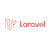

 

# Hi, I'm Rhea Labayo 👋✨✨ ⚡

I'm a Software Engineer specializing in building websites. I'm a passionate full stack web developer from the Philippines, my passion is to deliver a functional and a good looking website. I am also open to learn new web development tools so that I can deliver more powerful websites. 

Web development tools:

     

    

💬 Ask me about anything, I'm happy to help.

<!-- - 🔭 I’m currently working on ...
- 🌱 I’m currently learning ...
- 👯 I’m looking to collaborate on ...
- 🤔 I’m looking for help with ...
- 📫 How to reach me: ...
- 😄 Pronouns: ...
- ⚡ Fun fact: ... -->

Sharing with you a simple portfolio that I made and I will still improve it to share about myself, experiences and the skills that I have. To check my portfolio, kindly click this [link](https://rhealabayo.com/).

Thank you very much and I'm looking forward to talk to you...